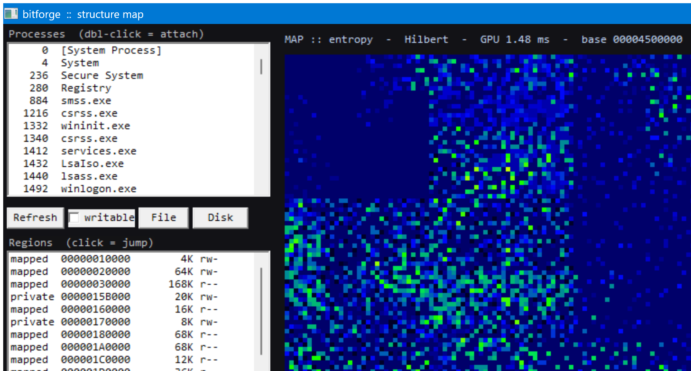
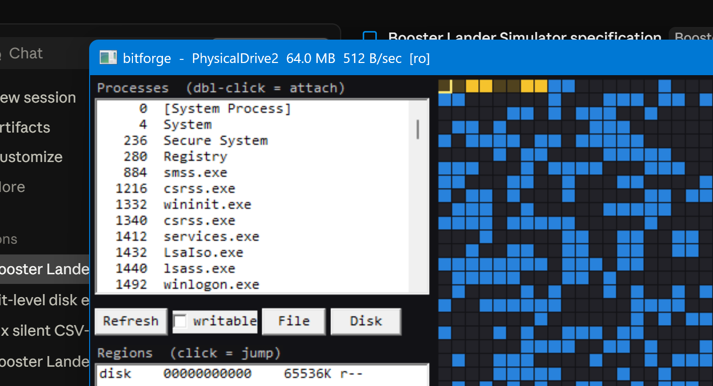
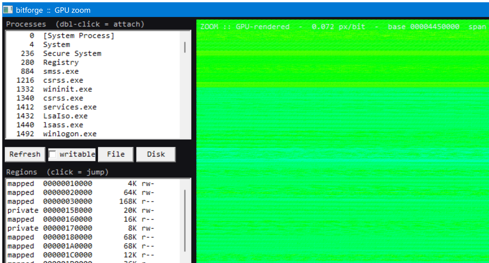
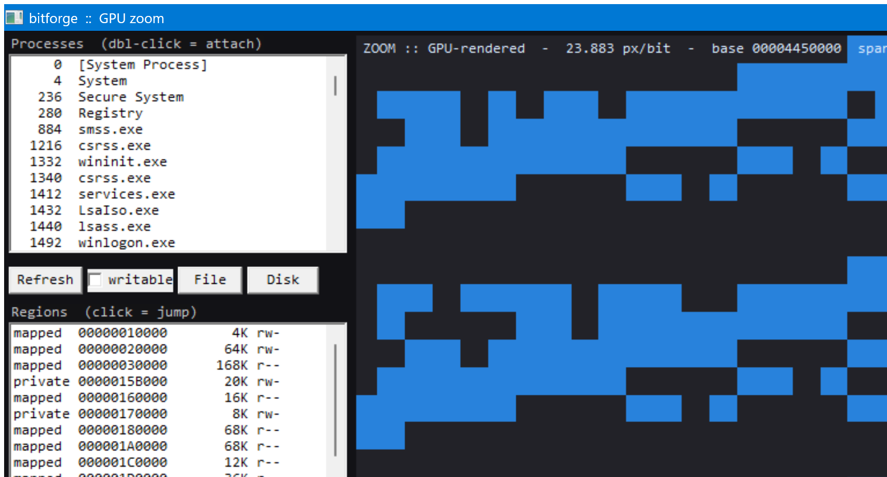

# bitforge

**A bit-level viewer / editor / scanner for Windows.** Every cell in the grid is one
bit — blue = `1`, dark = `0` — and you click it to flip it straight into the live
source. It attaches to a running **process** (via `ReadProcessMemory` /
`WriteProcessMemory`), a **file**, or its own **sandbox**, all behind a single
`IByteSource` interface, so a raw disk / VHDX / physical-memory / DMA source drops in
later without touching the UI, the scanner, or the renderer.

Zero external dependencies — pure Win32 + GDI. Built with MSVC.

---

## 🛰️ The Arecibo easter egg (transmit → render → detect)


Hit the **Arecibo** button and bitforge writes the 1974 Arecibo message — **1679 bits,
73 × 23** — as literal bits into a fresh `VirtualAlloc` sandbox, then sets the grid to
**23 columns** so *the raw memory bits are the picture*: you can see the DNA double
helix, the human figure, and the radio-telescope dish, all rendered straight out of
RAM. Click any cell to edit humanity's message to the stars.

Two twists:

- **Updated for 2026.** The message's population field originally encoded
  `4,292,853,750` (Earth's population in 1974). bitforge rewrites those 36 bits to
  today's world population, `8,303,169,803` (~8.3 billion) — located and re-encoded in
  the message's exact 2-D bit orientation, verified by round-trip decode. See
  [`arecibo/gen_arecibo.py`](arecibo/gen_arecibo.py).
- **A memory SETI scanner.** The **SETI** button closes the loop: it bit-searches the
  attached source for a distinctive 64-bit Arecibo signature (at *any* bit alignment),
  then verifies each candidate is the full 1679-bit message before declaring
  `>>> SIGNAL`. Transmit it, then listen for it — in your own RAM.

### 📡 SETI hunt — a screensaver that searches your own RAM


The **Hunt** button (or `--hunt`) turns bitforge into a SETI@home-style screensaver
pointed *inward*: a scrolling waterfall spectrogram sweeps the attached source's memory,
flagging structured "candidate signals" (Gaussian / Pulse / Triplet) as it goes. When it
finds and verifies a real Arecibo message it locks on with a **CONTACT** banner, then
transmits bitforge's own procedurally-generated, bilaterally-symmetric **alien reply**
back into memory ([`core/alien.h`](core/alien.h)). Detect Earth's message in your RAM,
reply with an alien one. `--hunt` seeds a 2 MB noise field with a planted message so you
can watch the sweep lock on.

---

## The everyday tool


- **Attach** a process (double-click, tick *writable* to edit) or open a file.
- **Bit grid** — click a cell to toggle that bit; arrow keys move the cursor, **Space**
  toggles, **PgUp/PgDn** scroll, **+/-** zoom, wheel scrolls. Recently-flipped bits
  **glow and cool off**, so you can watch memory change live.
- **Region map** — the whole address space (image / mapped / private, `rwx`), click to
  jump.
- **Scanner** — pick a type (`u8..u64`, `i8..i64`, `f32`, `f64`, or `bits` for an
  unaligned bit-pattern like `1011?01`), **First Scan**, then narrow with **Next Scan**
  (Exact / Unchanged / Changed / Increased / Decreased). Double-click a result to jump;
  **Freeze+** holds a value.

## Structure map (entropy + Hilbert)



The **Map** button renders the current region as a binvis/Veles-style overview: each cell
is a block of bytes coloured by local Shannon entropy (dark = low / zeros / text, bright =
high / code / compressed / encrypted), laid out along a **Hilbert curve** so nearby offsets
stay spatially adjacent and structure blooms into blobs. Press **H** to toggle
Hilbert/linear, and **click any cell to drill straight down into its bits** — the
whole-region-to-single-bit zoom. `--map` maps bitforge's own memory as a demo.

## Raw disk (`\\.\PhysicalDrive`)



The **Disk** button lists physical drives (queryable without admin) and attaches one as an
`IByteSource`, so the bit grid, scanner, structure map, and even the SETI hunt all work over
a whole disk. Reads/writes are sector-aligned with an internal read-modify-write, so you
still edit single **bits**; opening a live disk for writing locks and dismounts its volumes
first (Windows guards mounted-volume sectors). Raw `\\.\PhysicalDriveN` access needs
**Administrator** — develop against a disposable **VHDX** (`diskpart create vdisk` +
`Mount-DiskImage`) so you never risk a real disk. `DiskSource::open_image` also opens a raw
image file directly (no admin) through the same code path.

## GPU acceleration (CUDA)

The heavy compute — unaligned bit-search, value scan, per-block entropy — is the
embarrassingly-parallel part, so it's offloaded to the GPU (`gpu/gpu_bitforge.cu`). Measured
on a **GeForce RTX 4070 Ti SUPER**:

| workload | GPU | CPU (1 thread) | speedup |
|---|---|---|---|
| unaligned 32-bit search, 16 MB (134M bit offsets) | 139 ms | 3348 ms | **24×** |
| entropy map 128×128, 128 MB | 0.66 ms | 39 ms | **~60×** |
| value scan u32, 128 MB | 0.71 ms | — | — |

`build.bat` links CUDA automatically when `nvcc` is present (and copies the runtime DLL next
to the exe so it's self-contained); without it, everything falls back to the CPU paths. The
**structure map** computes its entropy on the GPU for in-memory spans (the header shows
`GPU x.xx ms`), and the CLI exposes `gpu` / `gpuscan`:

```
build_gpu.bat                                    # standalone CPU-vs-GPU benchmark
build\bitforge_cli.exe gpu                       # show the CUDA device
build\bitforge_cli.exe gpuscan file.bin 1011?01  # GPU unaligned bit search
```

### GPU zoom viewer

| zoomed out (whole region) | zoomed in (single bits) |
|---|---|
|  |  |

The **Zoom** button (or `--zoom`) uploads a region to VRAM and a CUDA kernel renders **every
displayed pixel** straight from the bytes at the current scale — one bit per block when zoomed
in, popcount-density heat over a block of bits when zoomed out (continuous level-of-detail).
No OpenGL context needed; the RGBA frame is blitted with `SetDIBitsToDevice`. Mouse wheel zooms
to the cursor, drag pans, Esc exits.

## Build

**One shot (MSVC):**
```
build.bat
```
Finds VS 2022 and compiles everything to `build\`. No external dependencies.

**CMake:**
```
cmake -B build
cmake --build build --config Release
```

## Use

```
build\bitforge_gui.exe            # then double-click a process, or Open File
build\bitforge_gui.exe <pid>      # attach on launch (read-only)
build\bitforge_gui.exe <file>     # open a file on launch
build\bitforge_gui.exe --arecibo  # transmit the Arecibo message into a sandbox
build\bitforge_gui.exe --seti     # transmit, then run the SETI detector
build\bitforge_gui.exe --hunt     # SETI@home-style memory-sweep screensaver + alien reply
build\bitforge_gui.exe --map      # entropy + Hilbert-curve structure overview
build\bitforge_gui.exe --disk N   # attach \\.\PhysicalDriveN (read-only; needs admin)
build\bitforge_gui.exe --zoom     # GPU continuous-LOD zoom viewer (needs CUDA)
```

Scriptable proof via the CLI:
```
build\target_toy.exe --hold                       # prints its PID + addresses
build\bitforge_cli.exe scan <pid> u32 100         # find a value
build\bitforge_cli.exe set  <pid> <addr> u32 1337 # write it
build\bitforge_cli.exe poke <pid> <addr> 7 0      # clear one bit
build\bitforge_cli.exe fscan <file> bits 01100100 # unaligned bit search in a file
build\bitforge_cli.exe disks                      # list physical drives
build\bitforge_cli.exe dread 2 0x0 512            # read a disk's boot sector (admin)
build\bitforge_cli.exe dpoke 2 <addr> 7 0         # flip one bit on the raw disk
```

## Architecture — one app, pluggable byte sources

Everything talks only to `IByteSource`, so the disk editor and the memory editor are
the *same* application over a different source:

```
IByteSource
  ├─ FileSource      a plain file (zero risk)
  ├─ ProcessSource   a live process (OpenProcess / VirtualQueryEx / RPM / WPM)
  ├─ BufferSource    a self-owned VirtualAlloc sandbox (the Arecibo scratch space)
  ├─ DiskSource      a raw disk \\.\PhysicalDriveN or a disk image (sector-aligned)
  └─ (roadmap)       kernel PhysicalMemory · PCILeech/DMA
```

The `bit_span` (get/set/toggle/popcount/**diff**), the address translator, the scanner,
and the GDI renderer are all shared.

```
core/   byte_source.h  bit_span.h  address.h  source_ops.h
        file_source.h  process_source.*  buffer_source.h  scanner.*  arecibo.h
cli/    bitforge_cli.cpp     console harness (proves the engine end-to-end)
gui/    bitforge_gui.cpp     Win32 + GDI bit-grid viewer/editor
target/ target_toy.cpp       a safe process to practice on
arecibo/ gen_arecibo.py + the 1974 and 2026 message grids
```

## Scope

Legitimate for your own processes, debugging, reverse engineering, CTFs, and
forensics on targets you own — not for defeating anti-cheat or DRM.

## Roadmap

- **GPU rendering** — done: a CUDA kernel renders every pixel for the continuous-LOD zoom
  viewer (see above). A future refinement is CUDA↔GL/Vulkan interop to skip the device→host
  copy for even higher throughput.
- **Deepest sources** — a kernel-driver `PhysicalMemory` source and a PCILeech/DMA source,
  behind the same `IByteSource`.

## Credits

The Arecibo message was designed in 1974 by Frank Drake, Carl Sagan, and others.
Prior art that inspired the tooling: Cheat Engine, ReClass.NET, binvis, Veles, ImHex.
